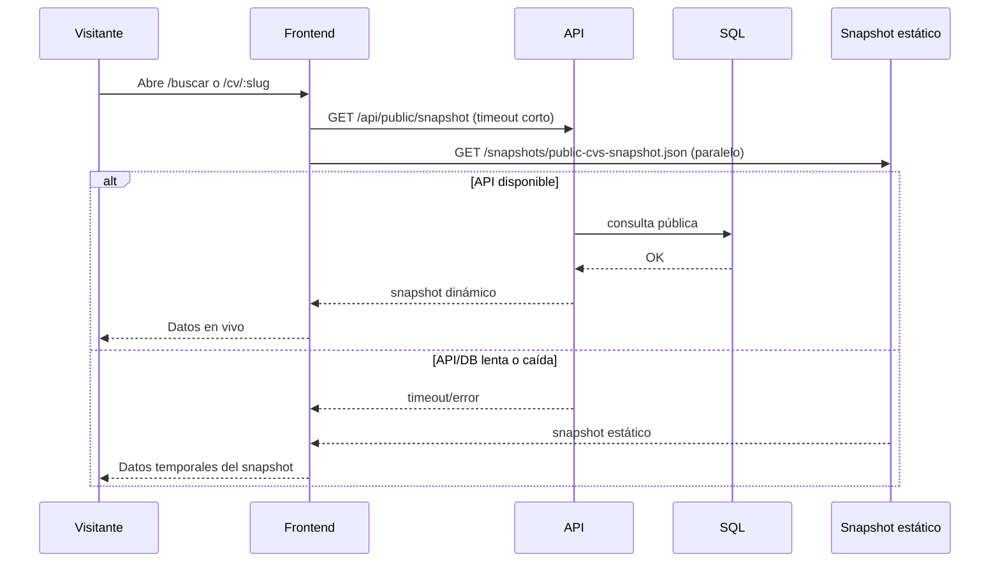

# Snapshot JSON para Cold Start (PortalCV)

## Objetivo

Evitar pantalla vacía cuando la API/DB está en arranque o no disponible, mostrando contenido público desde `frontend/public/snapshots/public-cvs-snapshot.json` y convergiendo a datos en vivo cuando la API responde.

---

## Estado actual implementado

1. El backend mantiene un export por CV en `PublicCvSnapshotExport` (JSON por `CurriculumId`).
2. Cada cambio de CV refresca ese export y marca `PublicStaticSnapshotState.SiteSnapshotStale = true`.
3. El admin revisa `GET /api/admin/public-cv-snapshot/pending`.
4. El admin descarga consolidado con `GET /api/admin/public-cv-snapshot/download` (o preview).
5. Se reemplaza `frontend/public/snapshots/public-cvs-snapshot.json` y se hace commit/deploy.
6. El admin confirma con `POST /api/admin/public-cv-snapshot/ack`.

Notas de negocio:
- El export por CV puede existir incluso en borrador.
- El consolidado público filtra solo `Curriculum.Estado = Publicado` y `Usuario.Estado = Activo`.

---

## Flujo de lectura en frontend

---

## Implicaciones

- **Frescura:** el archivo estático depende del ciclo download/commit/deploy.
- **Consistencia:** la fuente final sigue siendo API/DB.
- **Seguridad:** solo datos públicos en snapshot.
- **UX:** mostrar estado discreto:
  - “Datos en directo desde el servidor (base de datos).”
  - “Mostrando datos temporales del snapshot.”

---

## Readiness y autenticación

- El readiness se consulta en `/health/ready`.
- En local, el proxy frontend debe reenviar `/api` y `/health`.
- Para formularios de auth (login/registro/recuperación), se muestra aviso de “servicio iniciando” cuando aún no está `ready`.

