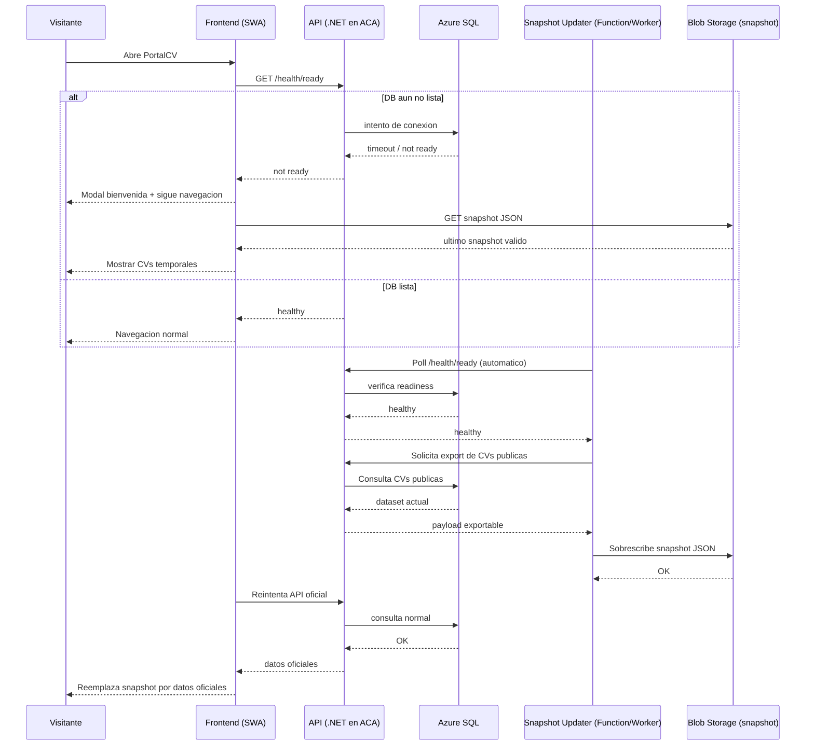

# Snapshot JSON para Cold Start (PortalCV)

## Objetivo

Evitar que el visitante espere en blanco cuando Azure SQL esta en arranque (cold start), mostrando CVs publicas desde un snapshot JSON temporal y cambiando a datos oficiales cuando la DB ya responda.

---

## Validacion del flujo propuesto

El flujo que propones es **coherente** y **tecnicamente viable**:

1. Visitante entra al portal.
2. Se muestra el modal de bienvenida/readiness (si la DB aun no esta lista).
3. El visitante puede continuar navegando hacia `/buscar` o `/cv/:slug`.
4. Mientras `/health/ready` no este en `Healthy`, frontend muestra datos desde snapshot JSON.
5. Cuando DB esta activa, un proceso automatico en servidor actualiza el snapshot JSON.
6. Desde ese momento, frontend usa datos oficiales de API/DB y el snapshot queda como respaldo.

---

## Diagrama de secuencia (v1 recomendada)

---

## Aclaracion clave de implementacion

El navegador **no debe** actualizar el JSON directamente en storage.  
La actualizacion del snapshot debe hacerla un componente con credenciales de servidor:

- Azure Function Timer (recomendado para gratuito/ligero), o
- Worker en Container Apps.

---

## Implicaciones (importantes)

### 1) Frescura de datos
- El snapshot puede estar desactualizado por minutos/horas.
- Debe mostrarse badge UX: `Mostrando datos temporales`.

### 2) Consistencia
- La verdad final sigue siendo DB/API.
- Frontend debe revalidar y reemplazar snapshot cuando API responda.

### 3) Seguridad
- Solo datos publicables en snapshot.
- Nunca incluir campos privados ni datos sensibles.

### 4) Costos (enfoque "sin costo")
- Con volumen bajo (11-20 CVs), esta estrategia es apta para capa gratuita.
- Aun asi, "sin costo" exacto depende del consumo real y limites del plan.

---

## Propuesta de operacion automatica (sin pasos manuales)

1. Function Timer corre cada X minutos.
2. Consulta `/health/ready`.
3. Si `healthy`, genera snapshot con CVs publicas.
4. Publica en Blob (`public-cvs-snapshot.json`).
5. Frontend intenta API; si falla usa snapshot; si API vuelve, reemplaza vista.

---

## Decision recomendada para iniciar

- **Alojamiento:** Blob Storage.
- **Formato:** Un JSON unico (v1) por simplicidad.
- **Actualizacion:** automatica por Function Timer + readiness.
- **Frontend:** snapshot-first + revalidacion contra API.

